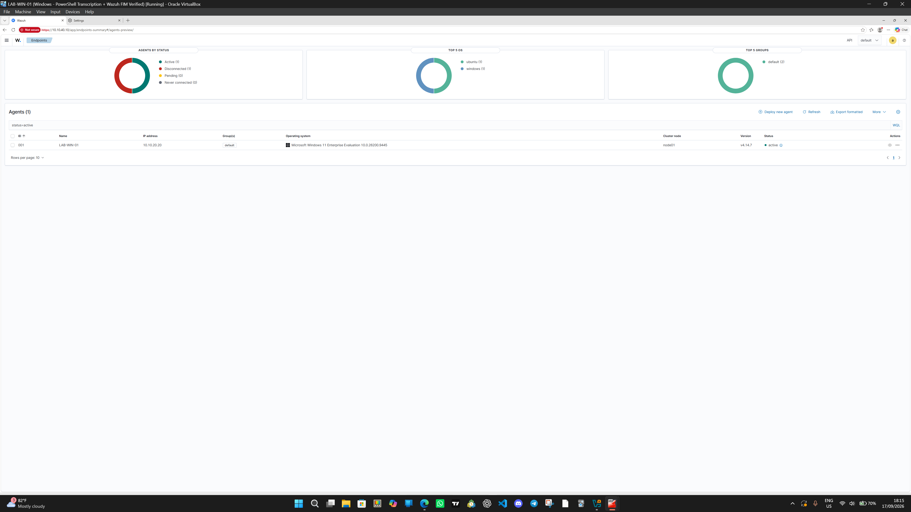
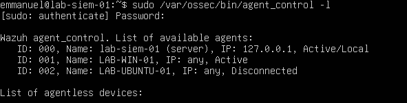

# Wazuh Agent Evidence

This directory contains visual evidence related to Wazuh agent deployment, enrollment, connectivity, status, and communication with the Wazuh manager.

## Current Monitored Agents

### LAB-WIN-01

- Operating System: Windows
- Network: CORPNET
- IP Address: `10.10.20.20`
- Wazuh Manager: `10.10.40.10`
- Status: Active and verified

### LAB-UBUNTU-01

- Operating System: Ubuntu
- Network: SERVERNET
- IP Address: `10.10.30.30`
- Wazuh Manager: `10.10.40.10`
- Status: Active and verified

## Evidence Scope

Evidence stored here may demonstrate:

- Wazuh agent installation
- Agent enrollment
- Agent service status
- Manager connectivity
- Agent status in the Wazuh Dashboard
- Agent communication across OPNsense security zones
- Agent reconnection after service or network interruption
- Agent troubleshooting
- Endpoint inventory visibility

## Evidence Examples

Recommended descriptive filenames include:

`wazuh-windows-agent-active.png`

`wazuh-ubuntu-agent-active.png`

`wazuh-dashboard-agents-overview.png`

`windows-wazuh-service-running.png`

`ubuntu-wazuh-agent-running.png`

## Verification Standard

Where possible, agent evidence should demonstrate both:

- Endpoint-side verification
- Wazuh manager or Dashboard-side verification

This provides evidence of the complete communication path rather than only proving that the local agent service is running.

## Security Review

Before committing screenshots, verify that they do not expose:

- Passwords
- Authentication keys
- Enrollment secrets
- API credentials
- Session tokens
- Private keys
- Personal information
- Other unnecessary sensitive data

## Verified Agent Status Evidence

### Wazuh Dashboard Verification

The Wazuh Dashboard was used to verify the current status of enrolled endpoint agents.

The Dashboard confirmed that `LAB-WIN-01` was actively communicating with the Wazuh manager.

At the time of verification:

- `LAB-WIN-01` — Active
- `LAB-UBUNTU-01` — Disconnected because the Ubuntu VM was intentionally powered off

This demonstrates that an agent showing as disconnected does not automatically indicate a security incident or communication failure. Endpoint operational state must be considered during investigation.

### Wazuh Manager CLI Verification

The Dashboard result was independently verified from `LAB-SIEM-01` using the Wazuh manager command-line utility:

`sudo /var/ossec/bin/agent_control -l`

The command returned the registered agent inventory and current status.

Verified results included:

- `LAB-SIEM-01` — Active/Local
- `LAB-WIN-01` — Active
- `LAB-UBUNTU-01` — Disconnected

### Dashboard and CLI Correlation

The Wazuh Dashboard and Wazuh Manager CLI reported consistent endpoint status.

The verification workflow was:

`Endpoint`

→ `Wazuh Agent`

→ `Wazuh Manager`

→ `Dashboard Verification`

→ `CLI Verification`

This provides two independent views of the same monitoring state and demonstrates both graphical SOC investigation and backend Wazuh administration skills.

### SOC Analyst Lesson

A disconnected Wazuh agent should be investigated in context.

Possible causes can include:

- Endpoint intentionally powered off
- Wazuh agent service stopped
- Network connectivity failure
- Firewall policy blocking communication
- Wazuh manager communication problems
- Endpoint failure

In this test, `LAB-UBUNTU-01` being disconnected was expected because the VM was intentionally offline.

The Windows endpoint remained active, confirming successful communication between CORPNET and the Wazuh manager on SOCNET.
